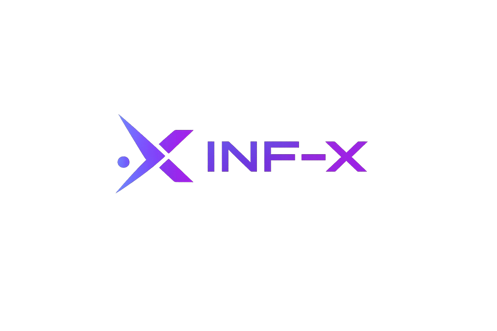

# Inference-x

<div align="center">
  
  <h3>Private, Offline AI on Your Android Device</h3>
</div>

---

## 📖 The Story of Inference-x

Inference-x (formerly *Mobile Llama*) wasn't just built; it was forged through a series of complex engineering challenges. Our goal was simple but ambitious: **run powerful Large Language Models (LLMs) entirely offline on standard Android phones.** No cloud, no subscription, no data leak.

### The Challenge: "It Can't Be Done"
Early in development, we faced the harsh reality of mobile hardware. Running a 1.1 billion parameter model on a phone CPU sounded impossible. Mobile RAM is scarce, and thermal throttling is real.

**The Hardship:**
Our first attempts crashed instantly. "Out of Memory" was our constant companion. We realized that standard FP16 models were too heavy.
**The Breakthrough:**
We dived deep into *Quantization*. By adopting the GGUF format and Q4_K_M quantization (compacting weights to 4-bits), we managed to squeeze the model into ~700MB of RAM without destroying its intelligence.

### The Bridge: Crossing the JNI Gap
Android runs on the JVM (Kotlin), but the raw speed needed for inference lives in C++.
**The Struggle:**
Connecting these two worlds was a nightmare of `UnsatisfiedLinkError` and segmentation faults. We fought with CMake build systems, architecture mismatches (arm64-v8a vs x86), and raw memory pointers.
**The Solution:**
We built a custom JNI (Java Native Interface) bridge. It manually loads the native library, managing the delicate lifecycle of C++ pointers from Kotlin, ensuring that when you close the app, the memory is cleanly freed.

### The Evolution: From Single to Many
Initially, the app could only run one specific model. But users wanted choice. They wanted to experiment with *Qwen 2.5*, *Phi-3*, and *Mistral*.
**The Refactor:**
We tore down the single-model architecture. We rebuilt the `ModelRepository` from scratch to support **Parallel Downloads** and **Dynamic State Management**. Now, Inference-x isn't just a player; it's a manager. You can download three models at once, switch between them instantly, and the neural engine hot-reloads in milliseconds.

---

## ⚡ Key Features

- **True Offline AI**: Once downloaded, the model lives on your device. Airplane mode? No problem.
- **Multi-Model Support**: Switch between TinyLlama, Qwen, Phi, and more.
- **Parallel Downloads**: Manage your AI fleet with a robust, concurrent download manager.
- **Privacy First**: Your chats never leave your device.
- **Appealing UI**: A "Premium Teal" aesthetic with smooth animations and a dedicated Navigation Drawer.

## 🛠️ Technical Stack

- **Core**: Kotlin (Android) + C++ (Native Inference)
- **Engine**: llama.cpp (The heart of the beast)
- **Architecture**: MVVM + Repository Pattern
- **UI**: Jetpack Compose (Modern, Reactive UI)
- **State**: Coroutines & Flows (for that silky smooth streaming text)

## 🚀 Getting Started

### Prerequisites
- Android Studio Ladybug or newer
- NDK (Side-by-side)
- CMake

### Build Instructions
1.  **Clone the Repo**:
    ```bash
    git clone https://github.com/your-username/Inference-x.git
    ```
2.  **Sync Gradle**: Let Android Studio fetch dependencies.
3.  **Build**:
    ```bash
    ./gradlew assembleArm64Debug
    ```
4.  **Run**: Deploy to your Android device (ensure Developer Mode is on).

## 🤝 Contribution

We welcome fellow engineers who want to push the limits of mobile AI.
- Found a bug? Open an issue.
- Want to add LoRA support? Submit a PR.

---
*Built with ❤️ and a lot of caffeine.*